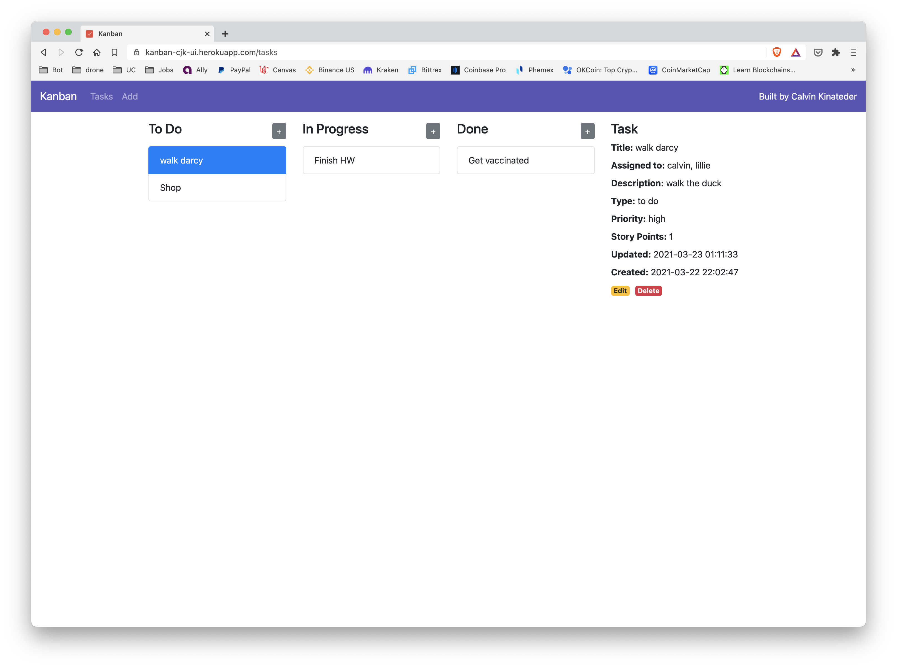
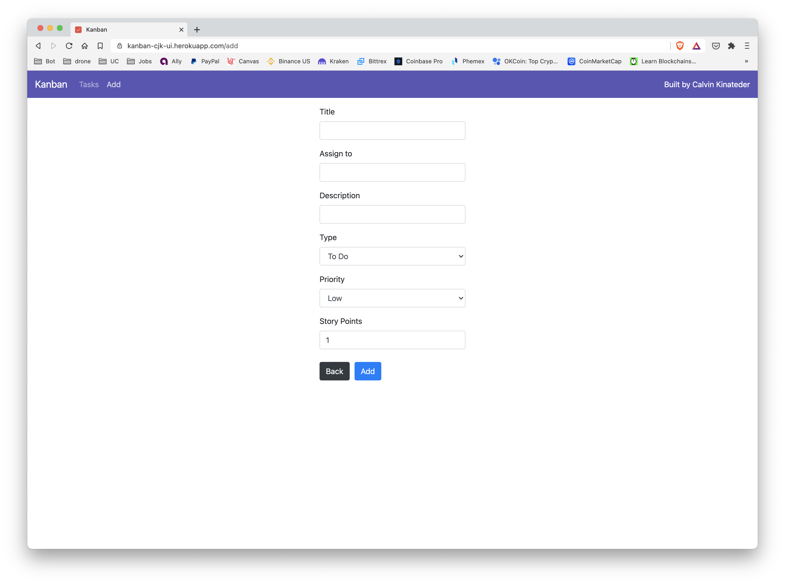
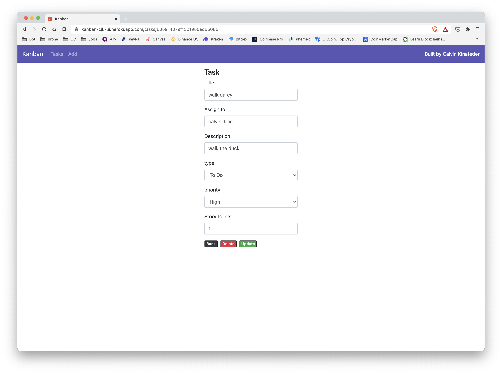

# kanban-board

I designed this application using the MERN ([MongoDB](https://www.mongodb.com/), [Express](https://expressjs.com/), [React](https://reactjs.org/), [Node.js](https://nodejs.org/en/)) stack. If you're unfamiliar, [MongoDB](https://www.mongodb.com/) is used for the persistent storage, [Express](https://expressjs.com/) is used to simplify the backend, [React](https://reactjs.org/) is used to simplify the frontend, and [Node.js](https://nodejs.org/en/) is used as the codebase all around. First, I built up the backend. I hadn't used Express before, but this was probably the easiest part for me, as I have some experience in Node.js and developing REST APIs. I had never used MongoDB before, but I find it really simple (especially coming from MySQL). Then, I started implementing the frontend. This was definitely a challenge, because I had **almost no React experience before this**, but I enjoyed it. It wasn't too hard to pick up in a weekend. After I had the base app working, I implemented some unit tests for the backend. Then, I set up both the [frontend](https://kanban-cjk-ui.herokuapp.com/) and [backend](https://kanban-cjk-api.herokuapp.com/api/tasks) to be hosted on [heroku](https://dashboard.heroku.com/). This was a huge challenge at first. CORS kept blocking my API calls, so I had to go back to the backend and mess with the main class. Once I got it unblocked, the UI worked.

Click [here](https://kanban-cjk-ui.herokuapp.com/) to visit the live app hosted on Heroku. 

### Video Overview

[](https://youtu.be/bI4XyAtftOc "Overview")

## UI

### Home



### Add Task



### Edit Task



## Next Steps

I plan on continually developing this, and I'd just like to see how far I can build it out. The next thing I'll add is a way to add users, and have a sign-on page so that one database isn't live for everyone. I'd also like to add inline title editing, as well as the ability to drag-and-drop tasks.

## Setup

Because the backend API is hosted on heroku [here](https://kanban-cjk-api.herokuapp.com/api/tasks), you only need to clone the frontend to run it locally.

``` bash
$ git clone https://github.com/ckinateder/kanban-ui.git
```

You can start the [frontend](https://github.com/ckinateder/kanban-ui) with

``` bash
$ cd kanban-ui
$ npm install
$ npm start
```

However, if you would like to clone the api as well, you may do so with

``` bash
$ git clone https://github.com/ckinateder/kanban-api.git
```

You can start the [backend](https://github.com/ckinateder/kanban-api) in the same way, with

``` bash
$ cd kanban-api
$ npm install
$ npm start
```

In order to run the app locally, you may have to modify the environment variables. If you only want to mess with the frontend, you just have to run `npm start` in the `kanban-ui` directory. However, if you want to update the API, you'll need to edit the `.env` variables. For example, when I'm developing locally, this is what my `.env` files look like.

In `kanban-api/`

```
PORT=5000
DB_URL=mongodb://localhost:27017
TEST_API_URL=http://localhost:5000
```

In `kanban-ui/`

```
PORT=5001
REACT_APP_SERVER_URL=http://localhost:5000
```

For another example, since by default the database is hosted on atlas, if I'm not messing with the database, my `DB_URL` looks like `mongodb+srv://<username>:<password>@<cluster-url>/<db-name>?retryWrites=true&w=majority`. 

And when **I'm only developing the front end**, my `kanban-ui/.env` file looks like

```
PORT=5001
REACT_APP_SERVER_URL=https://kanban-cjk-api.herokuapp.com/
```

## Tests

Just run the following command in the `kanban-api` directory to run the mocha tests.

``` bash
$ npm test

> kanban-server@1.0.0 test /Users/calvinkinateder/Documents/Projects/React/kanban-board/kanban-api
> mocha 'test/*test.js' --recursive


  GET /api/tasks
    ✓ returns all tasks in the database (131ms)

  POST /api/tasks and add to do
    ✓ adds a new task (to do) (89ms)

  POST /api/tasks and add in progress
    ✓ adds a new task (in progress) (103ms)

  POST /api/tasks and add done
    ✓ adds a new task (done) (129ms)

  GET ALL TO DO /api/tasks
    ✓ returns all to do tasks in the database (112ms)

  GET ALL IN PROGRESS /api/tasks
    ✓ returns all in progress tasks in the database (96ms)

  GET ALL DONE /api/tasks
    ✓ returns all done tasks in the database (91ms)


  7 passing (762ms)

```

## Extra Links

Frontend: [https://github.com/ckinateder/kanban-ui](https://github.com/ckinateder/kanban-ui)

Backend: [https://github.com/ckinateder/kanban-api](https://github.com/ckinateder/kanban-api)

